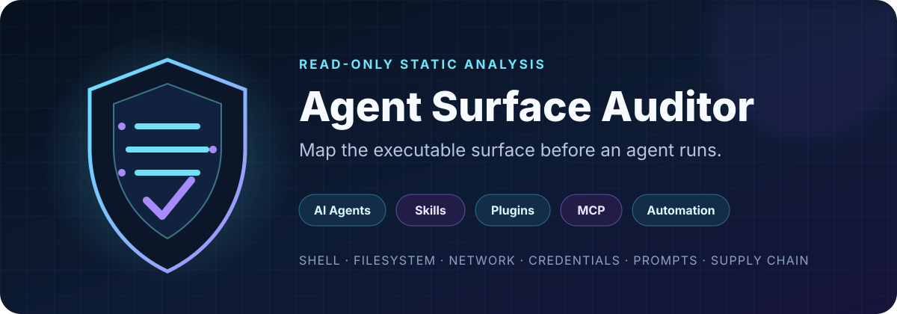
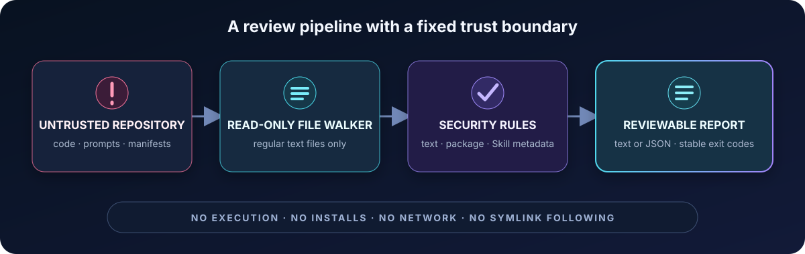
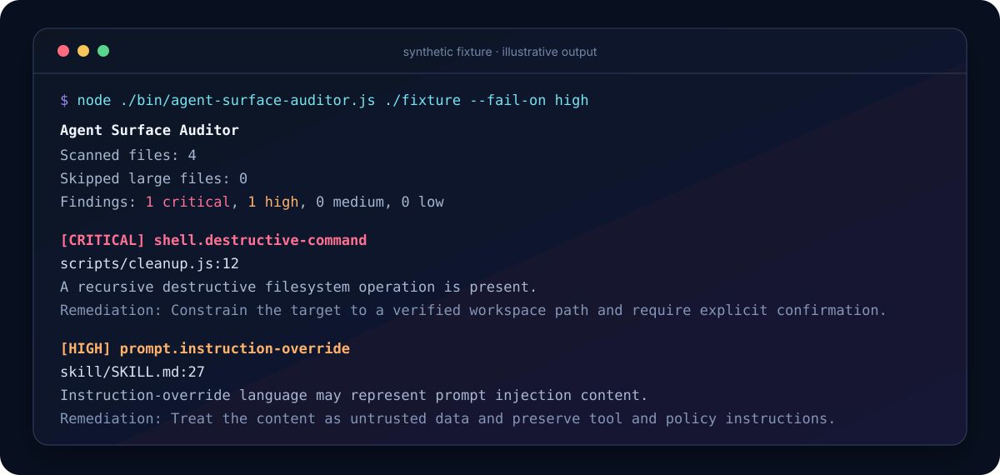

<p align="center">
  
</p>

<h1 align="center">Agent Surface Auditor</h1>

<p align="center">
  Review the executable surface of AI agents, Skills, plugins, MCP servers, and automation before anything runs.
</p>

<p align="center">
  <a href="https://github.com/agentsec-labs/agent-surface-auditor/actions/workflows/ci.yml"></a>
  
  
  <a href="LICENSE"></a>
</p>

<p align="center">
  <a href="#quick-start">Quick start</a> ·
  <a href="#what-it-detects">Detection coverage</a> ·
  <a href="#security-model">Security model</a> ·
  <a href="skill/audit-agent-surface/SKILL.md">Codex Skill</a> ·
  <a href="CHANGELOG.md">Changelog</a>
</p>

Agent Surface Auditor is a dependency-free static analysis CLI for repositories that can influence an agent's shell, filesystem, network, credentials, prompts, package installation, or code execution. It turns those surfaces into reviewable findings before the repository reaches an agent runtime or a contributor review queue.

The scanner is read-only. It does not execute target code, install packages, follow symbolic links, or make network requests.

## Why this exists

Agent repositories often combine natural-language instructions with executable code and broad tool permissions. A conventional dependency audit does not explain whether a Skill can override instructions, a plugin launches local commands, an MCP server reads credentials, or an install hook changes the machine before review begins.

Agent Surface Auditor provides a small, reproducible first-pass review for exactly that boundary. A finding is a signal for human review, not proof that a vulnerability is exploitable.

## How it works

<p align="center">
  
</p>

1. Walk regular text files under the selected repository root.
2. Apply stable text, package, and Skill metadata rules.
3. Redact credential-like evidence before reporting it.
4. Emit human-readable text or structured JSON with deterministic exit codes.

## What it detects

| Surface | Representative checks | Why it matters |
| --- | --- | --- |
| Secrets | Private keys and hardcoded credential-like values | Agent logs and reports can expose committed secrets. |
| Shell | Command execution and recursive destructive operations | Tool-enabled code can cross from analysis into machine control. |
| Network | Outbound request primitives | Repositories can transmit content or credentials off-device. |
| Filesystem | Broad writes outside an expected workspace | A tool can overwrite user or system files. |
| Prompts | Instruction-override and policy-bypass phrases | Untrusted repository text can attempt to redirect an agent. |
| Supply chain | Lifecycle scripts and non-registry dependency sources | Installation can execute code before review. |
| Skills | Missing or weak Skill frontmatter | Ambiguous metadata makes invocation and trust boundaries harder to review. |

Every finding includes a stable rule ID, severity, file, line, redacted evidence, and a focused remediation note.

## Example report

<p align="center">
  
</p>

The image above is illustrative output from a synthetic fixture. It does not represent scan results for a third-party repository.

## Quick start

Requires Node.js 20 or newer.

```bash
git clone https://github.com/agentsec-labs/agent-surface-auditor.git
cd agent-surface-auditor
npm ci
npm test

# Scan this repository.
node ./bin/agent-surface-auditor.js .

# Scan another agent repository and fail on high-severity findings.
node ./bin/agent-surface-auditor.js ../another-agent --format json --fail-on high
```

### Exit codes

| Code | Meaning |
| --- | --- |
| `0` | No finding met the configured threshold. |
| `1` | At least one finding met the configured threshold. |
| `2` | The command or configuration was invalid. |

Use `--fail-on none` when a report should remain informational.

## Configuration

Add `.agentsurface.json` at the scan root:

```json
{
  "ignore": ["test/fixtures/**", "vendor/**"],
  "maxFileBytes": 1000000
}
```

Default exclusions include `.git`, `node_modules`, `dist`, and `coverage`. Symbolic links are not followed.

## Codex Skill

The repository includes [`skill/audit-agent-surface`](skill/audit-agent-surface), a validated Codex-compatible Skill for a read-only scan, finding triage, and a reviewable remediation plan.

The Skill preserves the same boundary as the CLI: it does not execute target repository code or authorize automatic fixes. Copy the Skill directory into a supported Codex Skills location, then invoke `$audit-agent-surface` for an agent repository review.

## Security model

| Invariant | Enforced behavior |
| --- | --- |
| Untrusted input | Scanned repository content cannot authorize commands or policy changes. |
| Read-only analysis | The scanner reads regular text files and does not modify the target. |
| No code execution | Target code, scripts, and package lifecycle hooks are never run. |
| No dependency installation | The scanner does not install packages from the target. |
| No network access | Scanning does not make outbound requests. |
| Symlink boundary | Symbolic links are not followed. |
| Secret handling | Evidence for credential and private-key findings is redacted. |

This project uses conservative pattern matching. It can produce false positives and can miss context-dependent vulnerabilities. A clean report is not a security guarantee. See [SECURITY.md](SECURITY.md) for disclosure guidance and the full trust boundary.

## Project status

Version `0.1.0` is an early public release. The CLI, text and JSON reporters, configuration file, CI workflow, test fixtures, and Codex Skill are available for review. See [CHANGELOG.md](CHANGELOG.md) for the committed project history. Adoption and download figures are not inferred or claimed.

Focused issues and pull requests are welcome. New rules require a fixture, expected severity, remediation guidance, and a false-positive discussion; see [CONTRIBUTING.md](CONTRIBUTING.md).

## License

[MIT](LICENSE)
